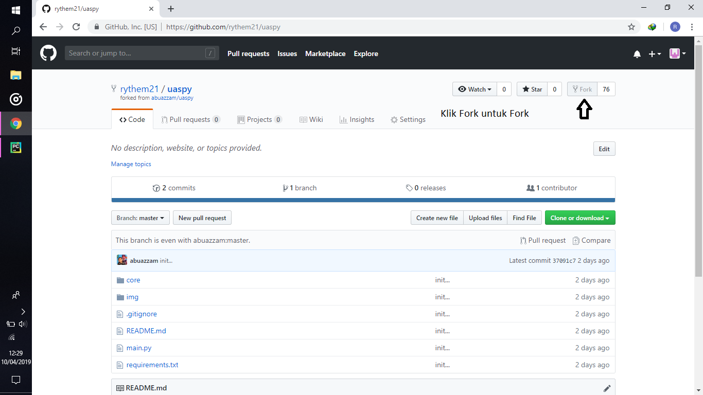
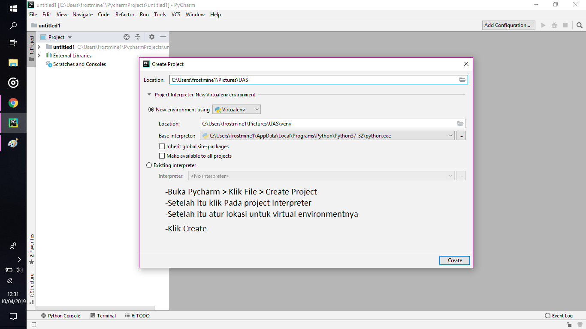
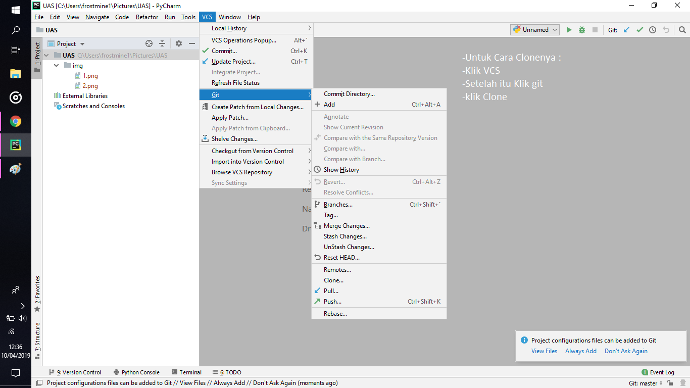
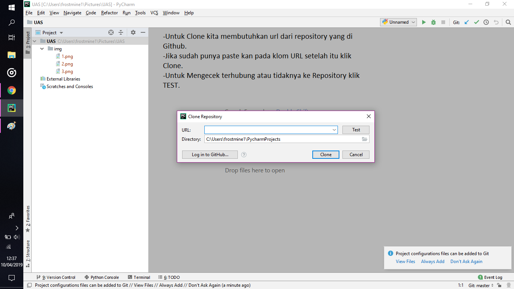
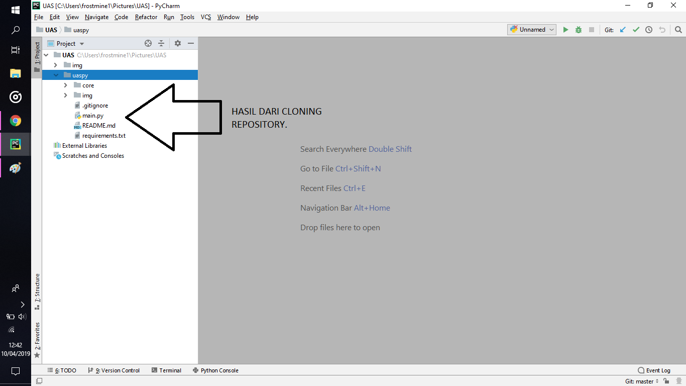
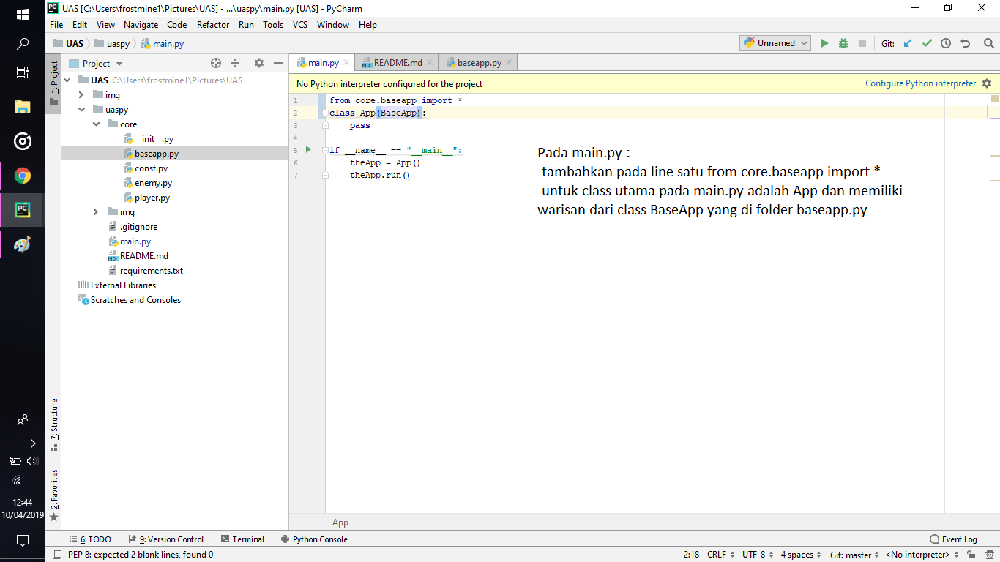
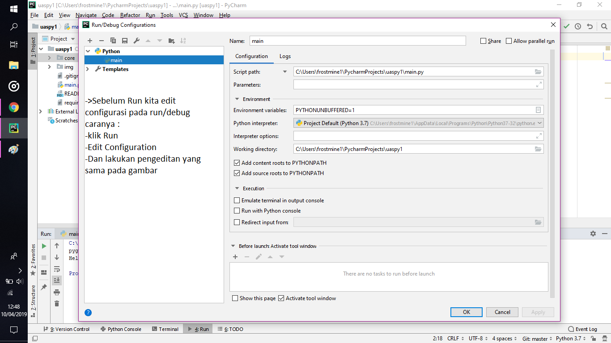
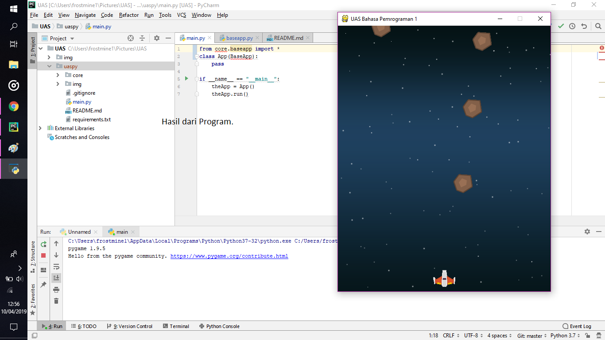
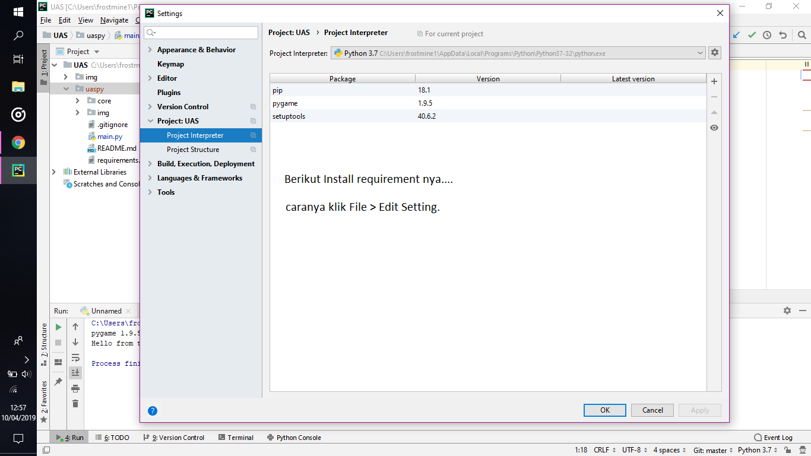

# UAS Bahasa Pemrograman 1

silakan tuliskan langkah-langkah disertai screenshotnya

# Langkah 1.

#langkah 2 

#Langkah 3

#langkah 4

#langkah 5

#langkah 6

#Langkah 7 

#Langkah 8 

#Untuk Tools Requirementnya 

